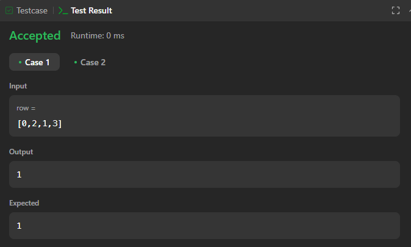
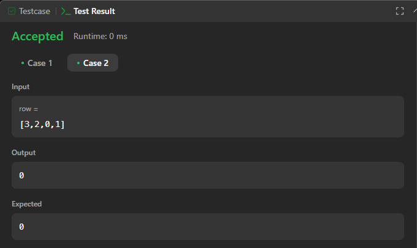

# Execícios do Leetcode

**Número da Lista**: 1<br>

**Conteúdo da Disciplina**: Grafos 1<br>

## Alunos

- Dupla 51

| Matrícula | Aluno                             |
| --------- | --------------------------------- |
| 190029692 | Igor Thaigo Lima de Santana |
| 202017540 | Breno Soares Fernandes      |

## Sobre

Este projeto tem como objetivo resolver questões do [LeetCode](https://leetcode.com/problemset/?search=graph&page=1&sorting=W3t9XQ%3D%3D) sobre grafos utilizando a linguagem de programação C. Abaixo, estão listadas as questões selecionadas, com seus respectivos níveis de dificuldade e vídeos explicativos da resolução.

## Questões

| Nome                                                                                                                                                  | Nível   |
| ----------------------------------------------------------------------------------------------------------------------------------------------------- | ------- |
| [765. Couples Holding Hands](https://leetcode.com/problems/couples-holding-hands/description/)      | Difícil |
| []() | Difícil |
| []()                   | Difícil |

## Vídeo

 Aqui terá o vídeo[]()

## Screenshots

### [765. Couples Holding Hands](https://leetcode.com/problems/couples-holding-hands/description/) 

 **Caso 1:**




 **Caso 2:**




**Linguagem**: C <br>

- ////

## Uso

```

///

```

## Outros

Quaisquer outras informações sobre seu projeto podem ser descritas abaixo.